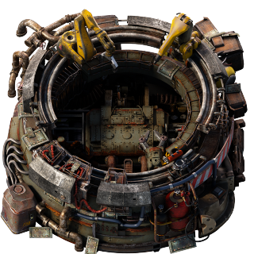

# Robotics Facility

The Robotics Facility is a Fulgora exclusive unlock that has productivity bonuses for crafting inserters, robots, defender capsules and personal equipment. 

## Credits

[Hurricane](https://www.figma.com/proto/y1IQG08ZG2jIeJ5sTyF4MP/Factorio-Buildings?node-id=2585-1158&node-type=frame&t=tk88gXWNIga60zMr-0&scaling=scale-down-width&content-scaling=fixed&page-id=0%3A1&starting-point-node-id=2585%3A1158&hotspot-hints=0&hide-ui=1) - Robotics Facility Graphics (adopted from his Gravity Assembler)

[Xorimuth](https://github.com/tburrows13) - Adopted low-grav-assembling-machine logic